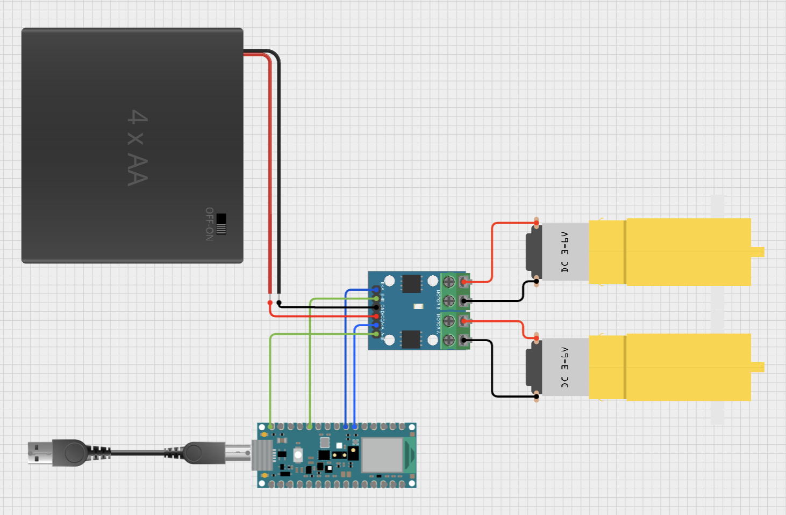
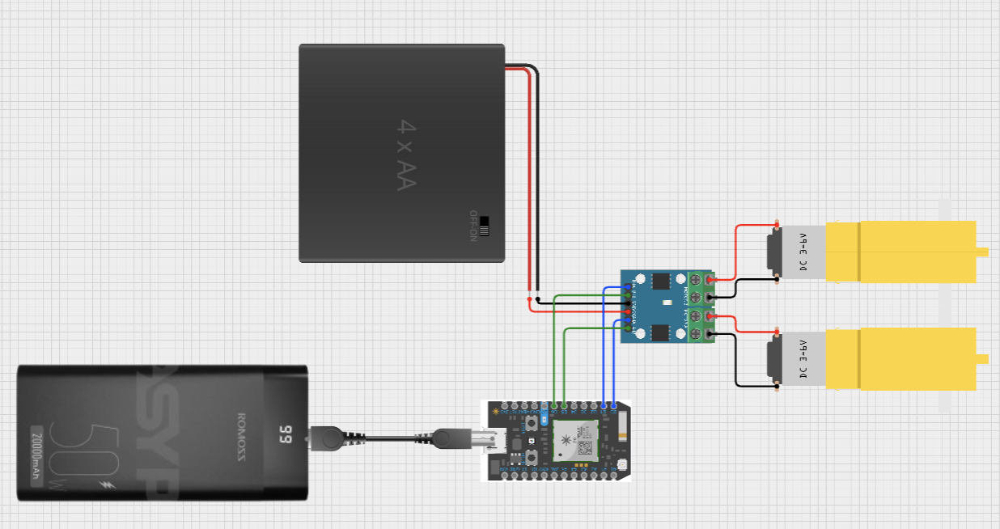

# Arduino Car
A simple car made with `Arduino Nano 33 BLE` or `Particle Photon` and TypeScript

## Arduino Nano 33 BLE setup (wired)
From Arduino IDE make sure you select the right board and port, then upload `StandardFirmataPlus`.

Make sure you select compatible pins for the `PWM` and `dir` (direction):



## Particle Photon setup (WiFi)
1. setup your particle device on your WiFi: https://setup.particle.io/
2. create an app in Particle Build: https://build.particle.io/build/new
3. paste the contents of `src/particleFirmata.ino`
4. save, verify, flash
5. create a `.env` from `.env.example` and fill it out with the following
6. get your "Device ID" from the "Devices" tab in Particle Build
7. create a Particle Token: https://docs.particle.io/reference/cloud-apis/access-tokens/#getting-a-user-access-token



## Quickstart
make sure you're using the right version of JavaScript:
```bash
nvm use
```

install dependencies:
```bash
yarn
```

start script:
```bash
yarn start
```

lint code:
```bash
yarn lint
yarn lint:fix
```